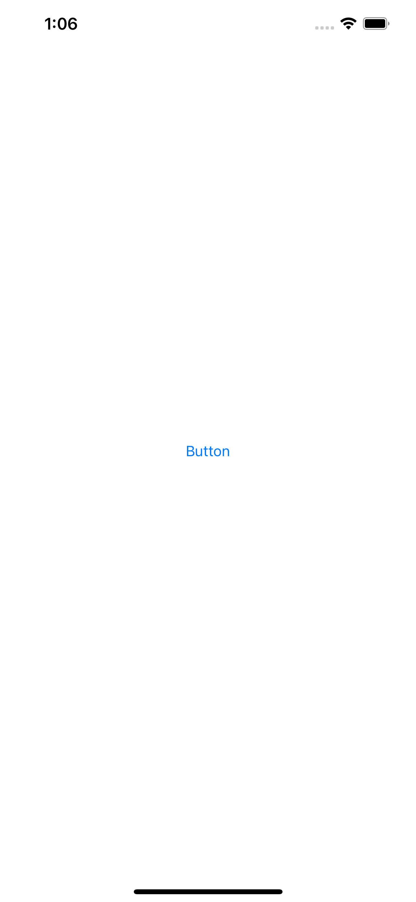
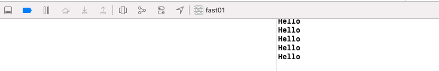
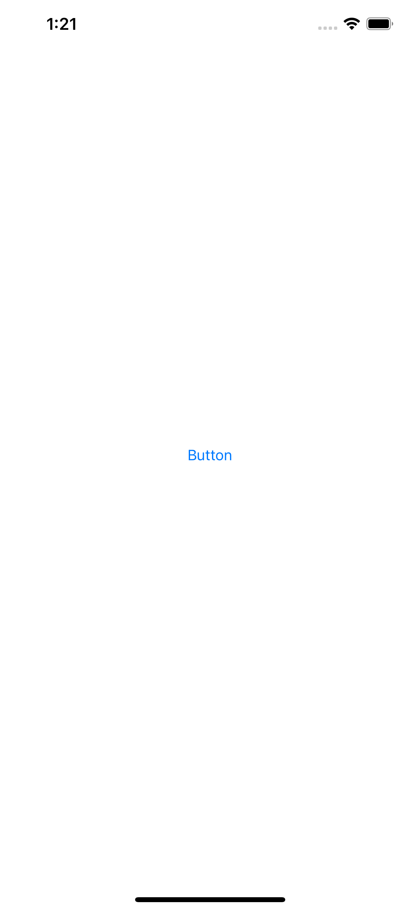
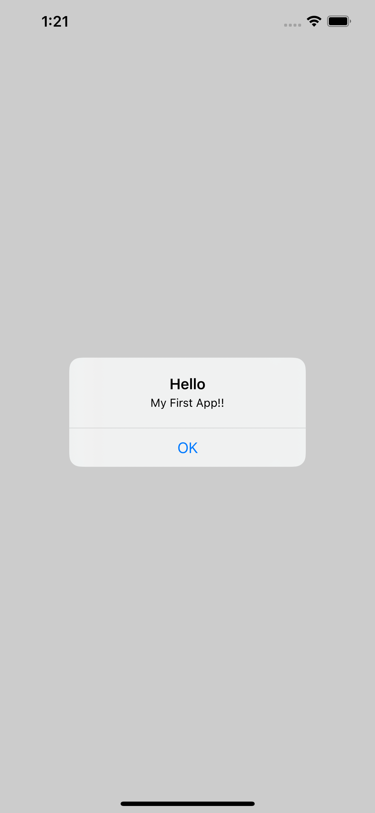

# FAST
Button 클릭 시 콘솔창에 문자 출력 

Button 클릭 시 팝업  

도전 과제 
<ul>
    <li>스토리보드에서 할 일</li>
    <ul>
        <li>새로운 버튼 추가 하기</li>
        <li>뷰 컨트롤러에 버튼 액션 연결하기</li>
    </ul>
    <li>코드에서 할 일</li>
    <ul>
        <li>메소드 새로 추가하기</li>
    </ul>
</ul>
    
